# GIẢI CÂU ĐỐ 8 Ô CHỮ (8 PUZZEL SOLVER) BẰNG ỨNG DỤNG NHIỀU THUẬT TOÁN TÌM KIẾM TRÍ TUỆ NHÂN TẠO VÀ TRỰC QUAN HÓA CÁC THUẬT TOÁN
## Lâm Văn Dỉ - 23110191
## 1.Mục tiêu
- Dự án game 8-puzzel được xây dựng nhằm mục đích triển khai các thuật toán trong 6 nhóm thuật toán:
  - Uninform Search (Tìm kiếm không có thông tin)
  - Informed Search / Heuristic Search (Tìm kiếm có thông tin)
  - Local Search (Tìm kiếm cục bộ)
  - Complex Environment Search (Tìm kiếm trong môi trường phức tạp)
  - Constraint-Based Search (Tìm kiếm trong môi trường có ràng buộc)
  - Reinforcement Learning (Học tăng cường)
- Cung cấp cho người dùng về hiệu suất giữa các thuật toán khác nhau trong 6 nhóm thuật toán

## 2.Nội dung
  ### 2.1 Các thuật toán tìm kiếm không có thông tin (Uninform Search)
  
  **Thành phần bài toán:**
  - Trạng thái: ma trận 3x3 gồm các số từ 0 đến 8 (0 là ô trống).
  - Hành động: di chuyển ô trống lên/xuống/trái/phải.
  - Chi phí đường đi: Tổng số bước di chuyển
  - Giải pháp (Solution): chuỗi các hành động dẫn đến trạng thái đích.
    
  **Các thuật toán trong nhóm**
  - **BFS (Breadth-First Search)** 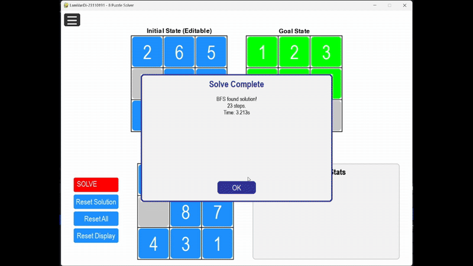
  - **DFS (Depth-First Search)** 
  - **IDS (Iterative Deepening Search)** 
  - **UCS (Uniform Cost Search)** 

   **Hiệu suất giữa các thuật toán** 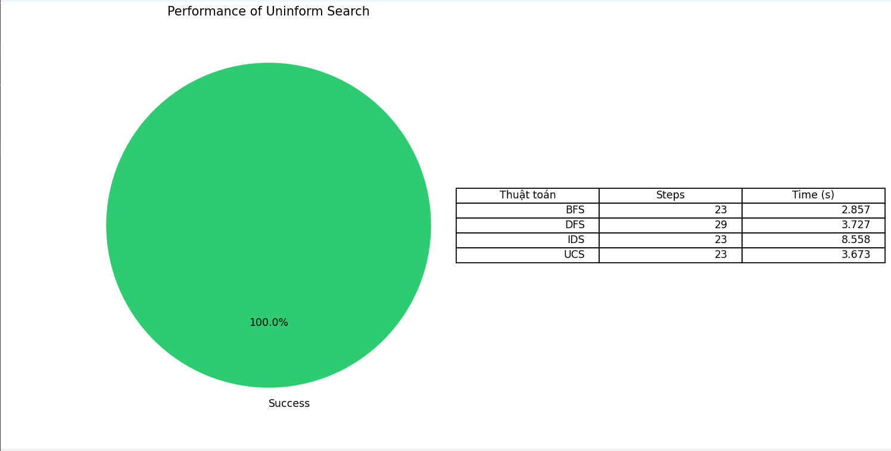
   
   **Nhận xét**
   - Breadth-First Search (BFS) tìm được lời giải tối ưu với độ dài 23 bước và mất 2.857 giây để hoàn thành. BFS duyệt theo mức (level) nên đảm bảo tìm được đường đi ngắn nhất về số bước, nhưng tiêu tốn nhiều bộ nhớ và thời gian hơn khi không sử dụng heuristic. Thời gian chạy tương đối cao cho thấy chi phí mở rộng theo chiều rộng tăng nhanh, đặc biệt khi không giới hạn độ sâu
   - Depth-First Search (DFS) chạy nhanh hơn BFS một chút (3.727 giây) nhưng lại cho ra lời giải dài hơn (29 bước). Đây là điều dễ hiểu vì DFS có thể đi sâu vào nhánh không tối ưu, dẫn đến lời giải dài hơn hoặc thậm chí thất bại nếu không đặt giới hạn độ sâu. Tuy nhiên, trong tình huống này, DFS đã tìm được lời giải và vẫn ở mức thời gian chấp nhận được, phản ánh đúng hành vi của thuật toán đệ quy theo chiều sâu.
   - Iterative Deepening Search (IDS) cho lời giải tối ưu (23 bước), nhưng lại tốn thời gian rất lớn – 8.558 giây, cao nhất trong số các thuật toán. IDS kết hợp DFS với tăng dần độ sâu giới hạn, nên thời gian cao là điều tất yếu do phải duyệt lại các tầng đã đi qua nhiều lần. Dù đảm bảo tìm được lời giải ngắn nhất như BFS, nhưng chi phí lặp lại cao khiến IDS không hiệu quả cho bài toán có độ sâu lời giải lớn như 8 Puzzle.
   - Uniform Cost Search (UCS) cũng tìm được lời giải tối ưu (23 bước) với thời gian 3.673 giây. UCS là phiên bản tổng quát của BFS có tính chi phí (ở đây mọi bước đều có chi phí bằng nhau, nên hành vi giống BFS). Mặc dù UCS đảm bảo tìm lời giải có tổng chi phí nhỏ nhất, trong bài toán này nó không khác BFS về số bước, nhưng vẫn cần quản lý hàng đợi ưu tiên nên tốn thời gian hơn đôi chút.
     
  **Nhận xét chung nhóm thuật toán**
  - Nhóm thuật toán cơ bản này cho kết quả chính xác và phản ánh đúng đặc điểm lý thuyết: BFS và UCS cho lời giải ngắn nhất nhưng tốn tài nguyên, DFS tìm được lời giải nhanh nhưng không tối ưu, còn IDS đảm bảo tối ưu nhưng phải đánh đổi thời gian rất lớn. Đây là cơ sở so sánh quan trọng trước khi sử dụng các thuật toán nâng cao có hỗ trợ heuristic.
     
  ### 2.2 Các thuật toán tìm kiếm có thông tin (Informed Search / Heuristic Search)
  - Các thuật toán này sử dụng hàm heuristic (trong code là manhattan_distance) để ước lượng khoảng cách còn lại đến đích. Có khả năng tìm đường hiệu quả hơn vì có định hướng
    
  **Thành phần bài toán:**
  - Trạng thái: ma trận 3x3 gồm các số từ 0 đến 8 (0 là ô trống).
  - Hành động: di chuyển ô trống lên/xuống/trái/phải.
  - Chi phí đường đi: Tổng số bước di chuyển
  - Hàm heuristic để dẫn đường tìm kiếm hiệu quả hơn.
  - Giải pháp (Solution): chuỗi các hành động dẫn đến trạng thái đích.
    
  **Các thuật toán trong nhóm**
  - **Greedy Search** 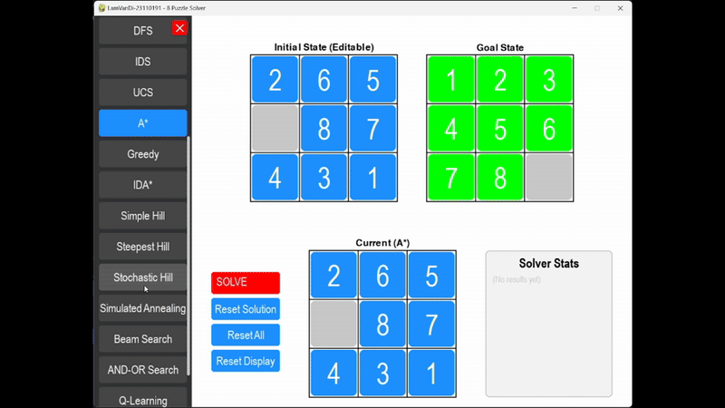
  - **A Star** 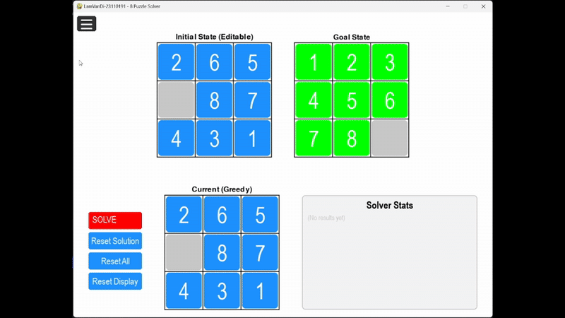
  - **IDA Star (Iterative Deepening A Star)** 
  
  **Hiệu suất giữa các thuật toán** 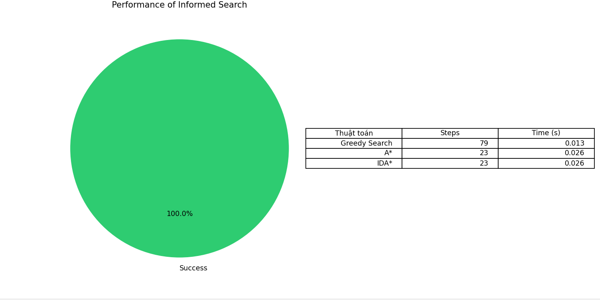
  
  **Nhận xét**
  - Thuật toán A* mất khoảng 0.026 giây và tìm được lời giải chỉ với 23 bước. Kết quả này cho thấy A* hoạt động chính xác theo lý thuyết: nó sử dụng cả chi phí thực g(n) và hàm heuristic h(n) (Manhattan distance) để đảm bảo tìm ra đường đi tối ưu ngắn nhất
  - Thuật toán Greedy có thời gian giải nhanh nhất, chỉ 0.013 giây. Tuy nhiên, số bước giải lại lên tới 79, cao hơn nhiều so với A*. Điều này hoàn toàn phù hợp với bản chất của thuật toán Greedy: nó chỉ quan tâm đến h(n) mà bỏ qua chi phí đã đi (g(n)), nên dễ bị lạc hướng hoặc chọn nhánh "trông có vẻ tốt" nhưng thực tế lại dài hơn
  - Thuật toán IDA* cũng mất 0.026 giây và tìm được lời giải dài 23 bước – giống hệt A*. Điều này xác nhận rằng IDA*, dù sử dụng chiến lược tìm kiếm theo độ sâu có điều kiện (threshold), vẫn giữ được tính tối ưu về lời giải.
  
  ### 2.3 Các thuật toán tìm kiếm cục bộ (Local Search)
  - Không quan tâm đến đường đi, chỉ tập trung cải thiện trạng thái hiện tại.
    
  **Thành phần bài toán:**
  - Trạng thái:Một trạng thái có thể hợp lệ hoặc ngẫu nhiên.
  - Hàm đánh giá (Objective Function): khoảng cách Manhattan từ trạng thái hiện tại đến trạng thái đích.
  - Hàm lân cận: Trả về các trạng thái kế cận.
  - Giải pháp (Solution): chuỗi các hành động dẫn đến trạng thái đích.
    
  **Các thuật toán trong nhóm**
  - **Simple Hill Climbing** 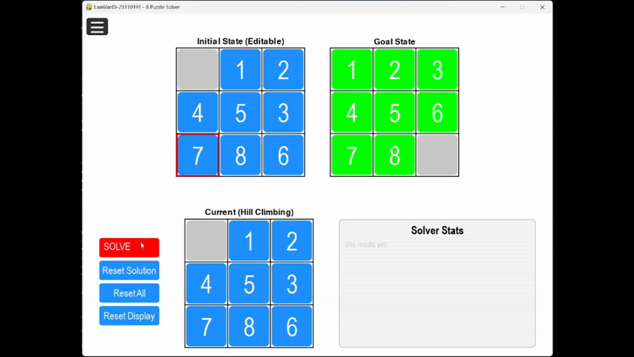
  - **Steepest-Ascent Hill Climbing** 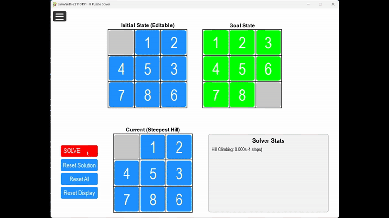 
  - **Stochastic Hill Climbing**  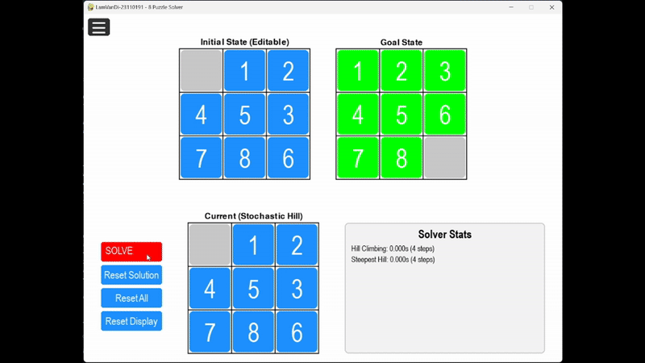
  - **Simulated Annealing**  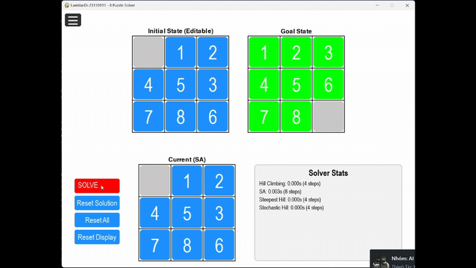
  - **Genetic Algorithm**  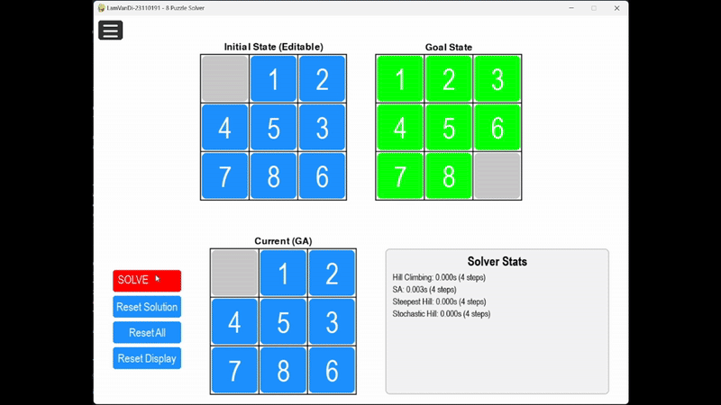
  - **Beam Search**  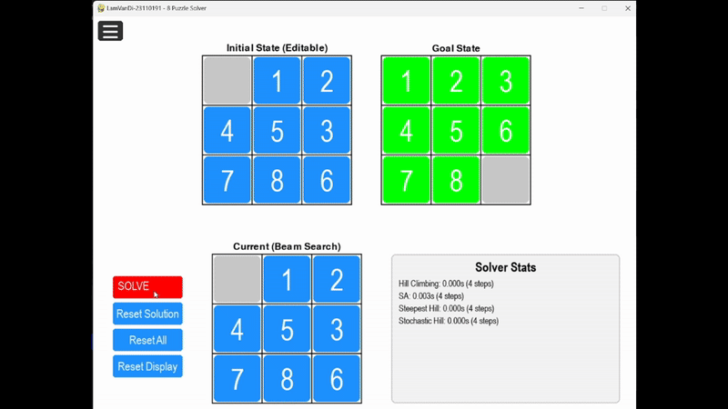
  
  **Hiệu suất giữa các thuật toán** 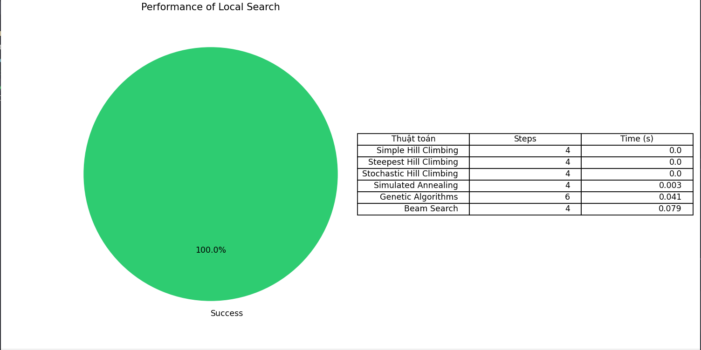

  **Nhận xét**
  - Genetic Algorithm (GA) mất 0.041 giây để giải bài toán với 6 bước đi. GA sử dụng quần thể các cá thể (mỗi cá thể là một chuỗi hành động), đánh giá fitness và tiến hóa qua nhiều thế hệ. Thời gian tương đối nhanh và lời giải ngắn (6 bước) cho thấy GA đã thành công trong việc tìm được lời giải hợp lệ, dù không tối ưu nhất
  - Hill Climbing, Steepest Hill, và Stochastic Hill Climbing đều cho kết quả giải rất nhanh (0.000s) và tìm ra lời giải trong 4 bước. Điều này chứng tỏ trạng thái đầu vào rất gần đích, và các thuật toán leo đồi đều tìm được hướng tốt ngay lập tức mà không bị kẹt tại đỉnh cục bộ
  - Simulated Annealing (SA) hoàn thành trong 0.003 giây và cũng tìm ra lời giải chỉ với 4 bước. Mặc dù SA cho phép chấp nhận bước đi tệ hơn theo xác suất (để tránh kẹt ở local optimum), trong trường hợp này nó nhanh chóng tìm ra lời giải vì đầu vào đơn giản
  - Beam Search mất 0.079 giây và cũng đạt lời giải trong 4 bước. Dù lời giải ngắn, thời gian chạy dài hơn do Beam Search phải duy trì và mở rộng nhiều nhánh song song theo độ rộng chùm (beam width). Kết quả này xác nhận Beam Search đã hoạt động đúng chức năng, và việc chọn được lời giải ngắn chứng tỏ heuristic Manhattan distance vẫn hiệu quả trong sàng lọc.

  **Nhận xét chung nhóm thuật toán**
  - Tóm lại, tất cả các thuật toán trong nhóm này đều hoạt động đúng logic cài đặt, với thời gian giải nhanh và số bước hợp lý, đặc biệt hiệu quả khi trạng thái đầu vào gần với đích. Tuy nhiên, trong những trường hợp phức tạp hơn, các thuật toán như Hill Climbing hoặc Beam Search có thể bị ảnh hưởng bởi local optimum hoặc độ rộng nhánh tìm kiếm.
    
  ### 2.4 Các thuật toán tìm kiếm trong môi trường phức tạp (Complex Environment Search)
  - Trạng thái không hoàn toàn quan sát được hoặc môi trường thay đổi. Trạng thái ban đầu có thể chứa None → cần sinh ra belief state.
    
  **Thành phần bài toán:**
  - Trạng thái không quan sát được hoàn toàn, hoặc thay đổi trong thời gian thực.
  - Cần xác định kế hoạch đảm bảo đạt đích trong mọi kịch bản.
  - Giải pháp (Solution): chuỗi các hành động dẫn đến trạng thái đích.
    
  **Các thuật toán trong nhóm**
  - **AND - OR Search - BFS**
  - Không giải được hoặc giải được nhưng chạy rất lâu nên em không để vào đây
  - **Partially Observable (Sensorless Search)** 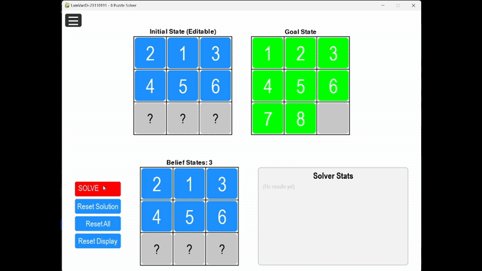
  - **Unknown or Dynamic Environment (Không nhìn thấy hoàn toàn – tìm kiếm trong môi trường niềm tin)** 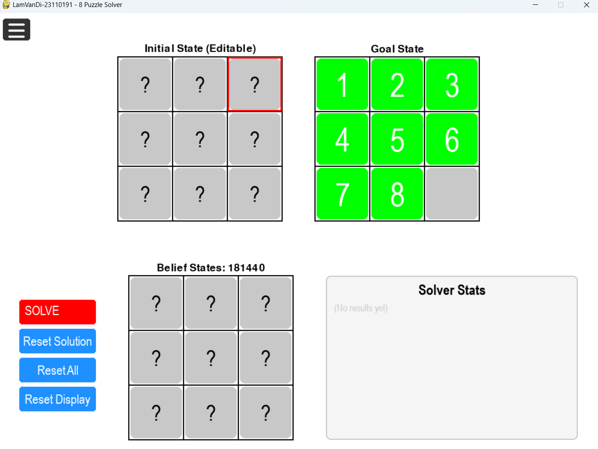
  
  **Hiệu suất giữa các thuật toán** 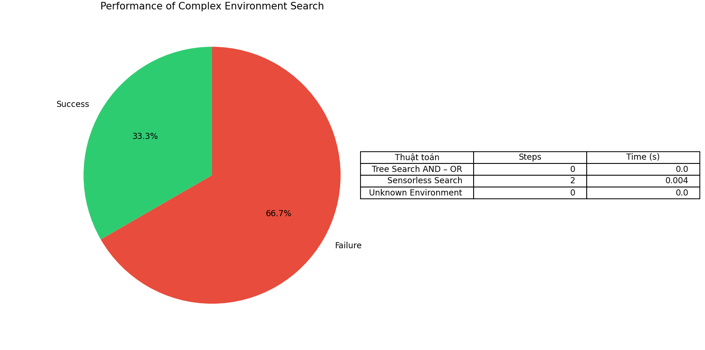

  **Nhận xét**
  - AND-OR Search cho kết quả rất nhanh (0.000 giây) nhưng không tìm được lời giải đến trạng thái mục tiêu (hiển thị “Not Goal”). Đây là thuật toán phù hợp cho các tình huống lập kế hoạch có điều kiện (conditional planning), nơi hành động có thể dẫn đến nhiều kết quả khác nhau. Tuy nhiên, với bài toán 8 Puzzle, AND-OR bị giới hạn do cách kiểm tra vòng lặp quá nghiêm ngặt (dùng chung visited set giữa các nhánh đệ quy), khiến nhiều nhánh hợp lệ bị loại bỏ. Ngoài ra, nếu trạng thái khởi đầu cách mục tiêu quá xa, thuật toán dễ bị cắt sớm do giới hạn độ sâu (depth limit)
  - Sensorless Search (tìm kiếm không cảm biến) là trường hợp đặc biệt khi trạng thái ban đầu không rõ ràng — một số ô trong ma trận có giá trị None. Thuật toán không biết chính xác trạng thái đang ở đâu, mà chỉ biết một tập hợp các trạng thái có thể (gọi là belief states). Trong thống kê, Sensorless Search tìm được lời giải chỉ với 2 hành động trong 0.004 giây, chứng tỏ bài toán ở mức đơn giản với số trạng thái tiềm năng ban đầu nhỏ
  - Unknown or Dynamic Environment (môi trường động hoặc không biết hoàn toàn) là trường hợp niềm tin ban đầu (belief state) có không gian rất lớn, thường do trạng thái đầu vào có quá nhiều ô bị khuyết (None). Trong những trường hợp như vậy, thuật toán phải liệt kê tất cả các hoán vị hợp lệ của các ô còn thiếu và kiểm tra khả năng giải được — điều này khiến số lượng belief states tăng nhanh theo cấp số nhân. Khi đó, thời gian chạy trở nên rất lớn và dễ vượt quá giới hạn. Dù thuật toán được thiết kế để hoạt động chính xác, nhưng nó không phù hợp với những cấu hình quá mơ hồ (missing nhiều ô), trừ khi được tối ưu mạnh.

  **Nhận xét chung nhóm thuật toán**
  - Tổng kết lại, nhóm thuật toán này thể hiện rõ khả năng xử lý tình huống không xác định, nhưng hiệu quả phụ thuộc rất lớn vào độ phức tạp của belief state và logic kiểm soát vòng lặp.
    
  ### 2.5 Các thuật toán tìm kiếm trong môi trường có ràng buộc (Constraint-Based Search - CSP)
  - Các thuật toán tìm kiếm trong môi trường có ràng buộc (Constraint-Based Search) được thiết kế để giải quyết bài toán thỏa mãn ràng buộc (Constraint Satisfaction Problem - CSP), nơi mà mục tiêu là tìm một hoặc nhiều giá trị cho các biến sao cho thỏa mãn một tập các ràng buộc đã cho
    
  **Thành phần bài toán:**
  - Trạng thái không quan sát được hoàn toàn, hoặc thay đổi trong thời gian thực.
  - Cần xác định kế hoạch đảm bảo đạt đích trong mọi kịch bản.
  - Giải pháp (Solution): chuỗi các hành động dẫn đến trạng thái đích.
    
  **Các thuật toán trong nhóm**
  
  **Backtracking** 

  **AC3** 
  
  **Kiếm thử** 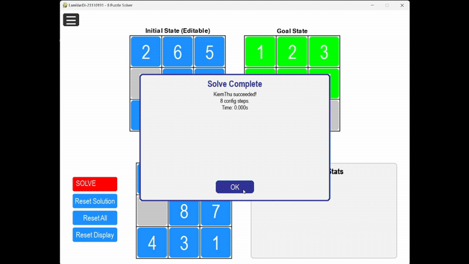 
        
  **Hiệu suất giữa các thuật toán**  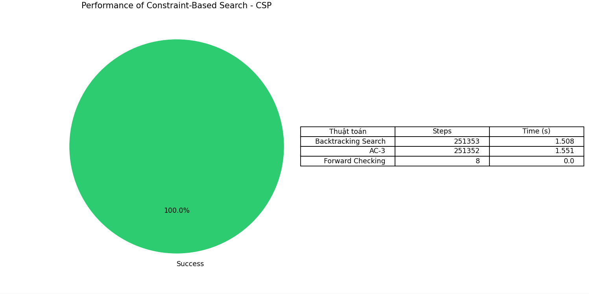 

  **Nhận xét**
  - AC3 & Backtracking: Thời gian gần tương đương (~1.5s), và số bước xử lý (steps) cũng rất lớn, khoảng 251.000 bước. Điều này cho thấy hai thuật toán này có mức độ tính toán nặng, có thể là do kích thước không gian tìm kiếm lớn hoặc việc ràng buộc các miền giá trị không hiệu quả tuyệt đối. Mặc dù AC3 thường có khả năng thu hẹp miền hiệu quả hơn, nhưng trong bài toán này không giúp giảm đáng kể số bước trong giai đoạn backtracking, nên tổng thời gian tương tự.
  - Kiểm thử: Thời gian cực kỳ nhanh (0.000s) và số bước cực kỳ ít (8 bước). Điều này cho thấy thuật toán KiemThu hoạt động theo cách gán trực tiếp các giá trị theo mục tiêu (goal state) và kiểm tra tính hợp lệ không phải là một giải thuật tổng quát mà chỉ kiểm tra được trong một số điều kiện cụ thể (như trạng thái mục tiêu là duy nhất và không có xung đột).

  **Nhận xét chung về nhóm thuật toán**
  - KiemThu có tốc độ cao nhất, nhưng khả năng ứng dụng bị giới hạn
  - AC3 và Backtracking tuy mất thời gian và bước nhiều, nhưng có khả năng tổng quát hơn để giải các bài toán ràng buộc phức tạp (CSP).
    
  ### 2.6 Học tăng cường (Reinforcement Learning)
  - Tìm chính sách hành động tối ưu (optimal policy) cho một agent (tác nhân) trong môi trường sao cho phần thưởng tích lũy là lớn nhất
    
  **Thành phần bài toán:**
  - Agent (tác tử) tương tác với môi trường để học hành động tối ưu qua thử và sai (trial and error)..
  - Phần thưởng (Reward) được cấp dựa trên hành động dẫn đến trạng thái mục tiêu.
  - Chính sách (Policy) dần được tối ưu hóa
  - Giải pháp (Solution): chuỗi các hành động dẫn đến trạng thái đích.
    
  **Các thuật toán trong nhóm**
  - **Q-Learning** 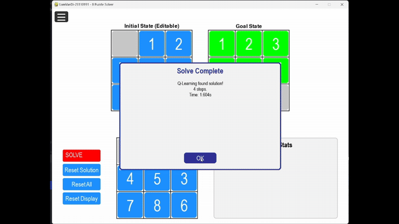
    
  **Hiệu suất giữa các thuật toán** 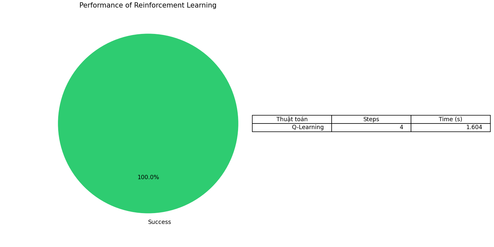

  **Nhận xét**
  - Q-Learning mất 1.604 giây để tìm được lời giải chỉ với 4 bước đi, cho thấy nó đã học được một chính sách hành động hiệu quả sau quá trình huấn luyện. Tuy thời gian chạy có vẻ cao hơn so với các thuật toán tìm kiếm cổ điển như A* hay BFS, nhưng điều này là do giai đoạn học (training) tốn nhiều thời gian để cập nhật giá trị Q cho tất cả các trạng thái – đặc biệt trong không gian trạng thái lớn như 8 Puzzle.
  - Q-Learning thể hiện tiềm năng cao trong việc giải bài toán khi không có tri thức ban đầu, và là hướng tiếp cận hiện đại thay thế cho các thuật toán tìm kiếm truyền thống trong môi trường động hoặc không xác định.

## 3.Kết luận
 - Dự án đã triển khai thành công nhiều nhóm thuật toán khác nhau để giải bài toán 8 Puzzle, từ các chiến lược tìm kiếm cơ bản, heuristic, đến các kỹ thuật học tăng cường và tiền xử lý nâng cao. Mỗi nhóm thuật toán đều thể hiện những đặc trưng riêng về hiệu quả thời gian, độ tối ưu lời giải và tính phù hợp với từng loại bài toán.
 - Không chỉ củng cố kiến thức về các thuật toán trí tuệ nhân tạo, mà còn mở rộng kỹ năng triển khai, tối ưu hóa và đánh giá hiệu suất thuật toán trên cùng một bài toán nền tảng. Dự án cũng đặt nền tảng tốt cho việc áp dụng các chiến lược AI phức tạp hơn trong các bài toán thực tế như lập kế hoạch, học máy và robot.

